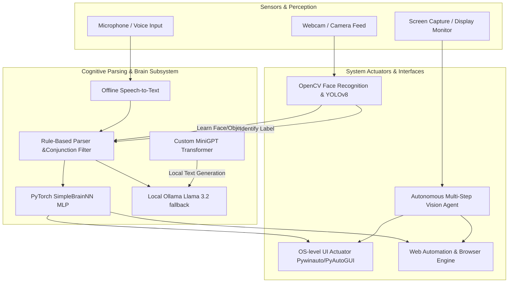

# ARIA: Advanced Responsive Intelligent Assistant
An Offline, Multimodal, Vision-Guided Autonomous System for Desktop Automation

---

## 📌 1. Project Overview & Problem Statement
Most modern AI virtual assistants (e.g., Siri, Alexa) are restricted to cloud-based API wrappers that require active internet connections, compromise user privacy, and lack direct integration with the host operating system. Conversely, autonomous agents often run in isolated terminal environments without real-time perception of the user's physical surroundings (such as face recognition) or visual display (screen capture).

**ARIA** addresses these limitations by establishing a **100% local, multimodal, closed-loop desktop assistant**. Running entirely on consumer-grade hardware (like a standard laptop CPU), ARIA integrates:
1. **Perception**: Real-time camera feed (YOLOv8 + OpenCV Haar Cascades/LBPH) and screen observation (PIL/Moondream Vision).
2. **Cognition**: A hybrid offline brain (Local neural network command classifier + Ollama/Llama 3.2 fallback + a custom character-level Transformer GPT model trained from scratch).
3. **Action**: OS-level UI actuation (Pywinauto, PyAutoGUI, AppOpener) to control applications, execute keyboard layouts, browse the web, and type text.

---

## ⚙️ 2. System Architecture
The diagram below illustrates ARIA’s multimodal loop, tracing user inputs from acoustic and visual sensors, through the cognitive parsing layers, to local system actuators:



---

## 🛠️ 3. Core Subsystems & Models Used

### A. Natural Language Cognitive Engine
* **Intent Classifier (`SimpleBrainNN`)**: A PyTorch-based Multi-layer Perceptron (MLP) trained on bag-of-words text inputs. Classifies user speech into structural tags (`CHAT`, `OPEN`, `TYPE`, `CLOSE`).
* **Conjunction Parser**: Intercepts speech, removes polite prefixes, and resolves typos (e.g., `"unigrm wrte mss"` $\rightarrow$ `[OPEN: unigrm]`).
* **Ollama/Llama 3.2 Fallback**: Routes complex conversational commands to a local Llama model when active.

### B. Computer Vision & Face Memory Subsystem
* **Face Detection & Recognition**: OpenCV Haar Cascades are combined with an **LBPH (Local Binary Patterns Histograms) Face Recognizer** to dynamically learn user identities (e.g., *"it me Chinmay"*) and store them in `labels.json`.
* **Object Identification (YOLOv8n + ORB)**:
  * **YOLOv8 Nano**: Evaluates live frames to natively detect 80 standard COCO classes (vehicles, food, people, household items).
  * **ORB Feature-Matching**: Captures ORB descriptors for unknown custom objects and matches them using a Brute-Force Matcher (`BFMatcher`).

### C. OS Actuation & Automation
* **Application Control**: Resolves Start Menu paths via **AppOpener** and spawns processes via `subprocess`.
* **Fuzzy Tab/Window Closers**: Utilizes keyboard macros (`Alt + F4`, `Ctrl + W`) bound to fuzzy vocal matching (e.g., misheard *"bar tab"*) to close resources.

### D. Custom Generative Transformer (`MiniGPT`)
* A character-level generative decoder model written from scratch in PyTorch featuring:
  * Multi-Head Self-Attention Blocks.
  * Layer Normalization and Positional Embeddings.
  * Autoregressive next-character sampling (with Top-K and temperature scaling).

---

## 📂 4. Dataset Directory
ARIA integrates structured files and datasets to run its classification and vision training locally:
* `dolly_dataset.csv`: 15,011 rows of instruction-following Q&A pairs (downloaded from Databricks/Hugging Face).
* `training_text.txt`: A text split of Tiny Shakespeare used for testing generative text synthesis.
* `supported_objects.csv`: Catalog of the 80 pre-trained categories supported natively by ARIA's camera loop.
* `custom_commands.json`: Users' custom action mappings.
* `intents.json`: Speech classification database used to train `SimpleBrainNN`.

---

## 🚀 5. Installation & Setup Guide

### Prerequisites
* Python 3.10+ (Tested on Python 3.13.7)
* Standard webcam and microphone

### Setup
1. **Clone the repository**:
   ```bash
   git clone https://github.com/yourusername/ARIA.git
   cd ARIA
   ```
2. **Install required dependencies**:
   ```bash
   pip install torch torchvision numpy opencv-python ultralytics AppOpener pyautogui pywinauto pygame PyQt5 datasets pandas
   ```
3. **Download local models** (Optional, for LLM/Vision fallback):
   * Install [Ollama](https://ollama.com) and pull models:
     ```bash
     ollama pull llama3.2
     ollama pull moondream
     ```

### Running ARIA
* **Launch the full Assistant with Sci-Fi GUI**:
  ```bash
  python main.py
  ```
* **Run in terminal-only mode**:
  ```bash
  python main.py --nogui
  ```

---

## 📌 6. System Limitations & Future Roadmap
* **Inference Speed**: Currently limited by single-threaded CPU evaluation for the custom GPT model. GPU acceleration will be added via DirectML/CUDA configurations.
* **Offline STT/VAD Accuracy**:
  * Implemented an advanced **Production Voice Pipeline (Level 2)** containing:
    * **Startup Noise Calibration**: Captures 1.0s of ambient room silence profile at startup.
    * **AI Denoising**: Spectral noise reduction via `noisereduce` applied before speech validation.
    * **WebRTC VAD & Energy Gates**: Dynamic RMS gating at 1200 threshold with ratio validation (45% for general speech, 60% for wake words).
    * **Barge-in Interruption**: Real-time mic monitoring during playback with a 400ms speaker bleed cooldown and a 10-frame (300ms) consecutive speech validation gate.
    * **Queue & Stop Management**: Fully synchronised speech queue cancellation and direct bypass stop keywords processing.
* **Roadmap to Level 3 & Beyond**:
  - [ ] **Speaker Diarization / Voice Recognition**: Profile the owner's voice to ignore background room chatter.
  - [ ] **Vector Database Memory Store**: Embeddings-based semantic retrieval and episodic memory summaries.
  - [ ] **Trained Intent Classifier**: Upgrade rule-based/regex routing to a trained deep learning classifier.
  - [ ] Support local fine-tuning of TinyLlama (1.1B) on the Dolly 15k dataset.
  - [ ] Multi-screen workspace automation mapping.
